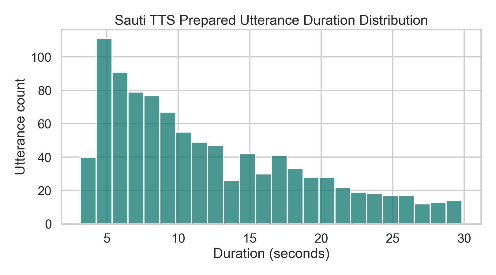
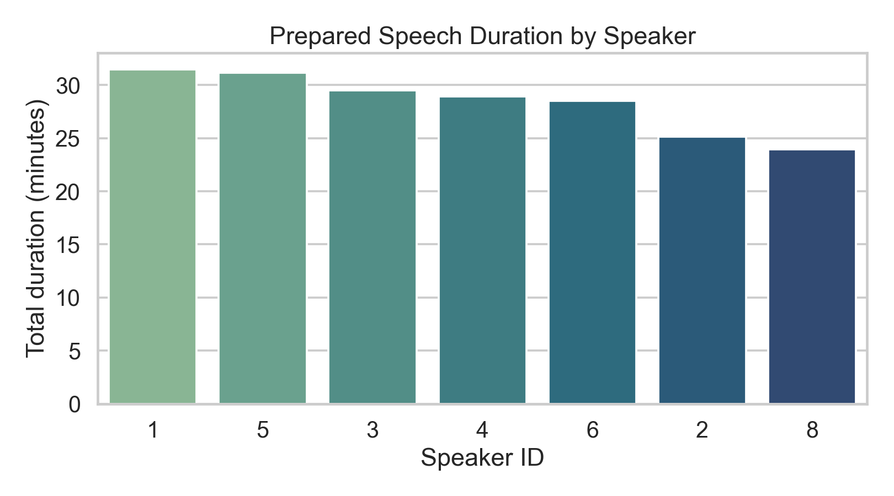
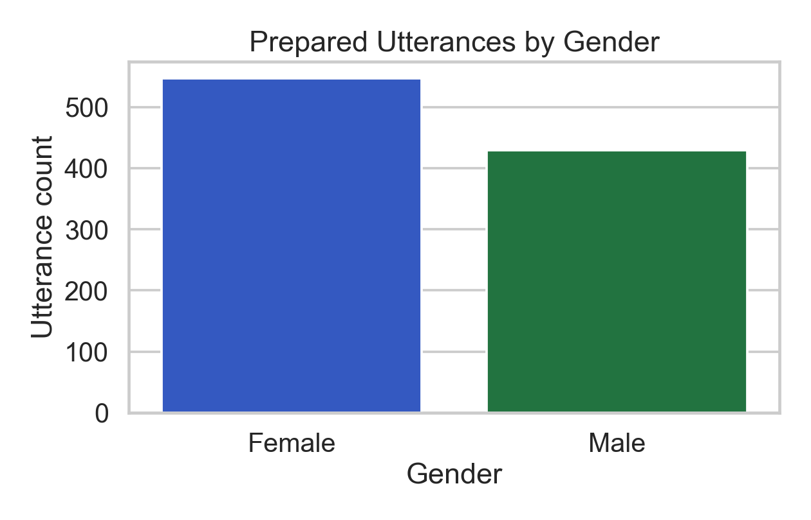
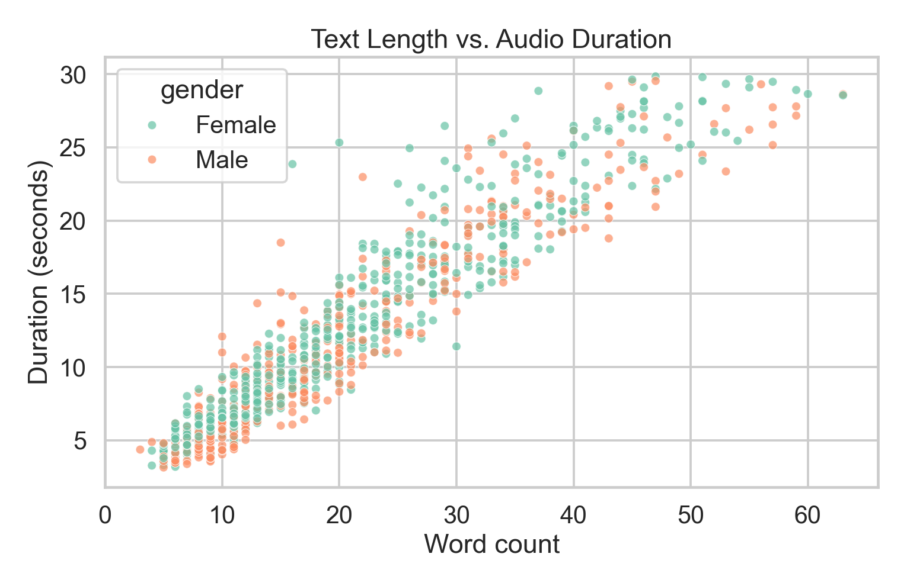
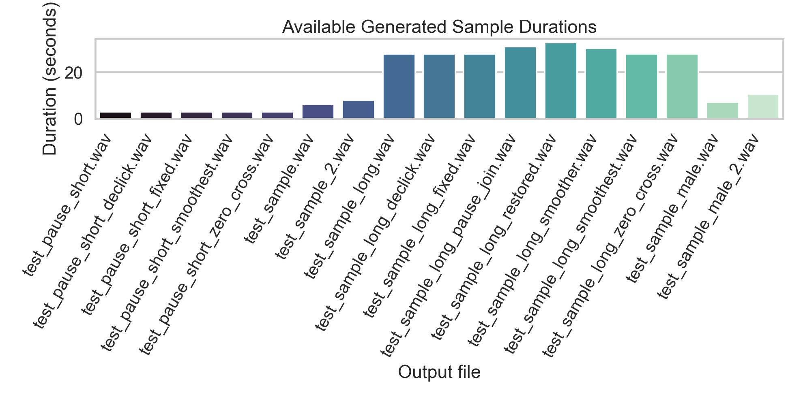

# Sauti TTS v1 Technical Report

**Organization:** MsingiAI  
**Authors:** Gilbert Korir, Irene Korir, Alfred Kondoro, Cyprian Kiplangat, Victor Ashioya, Ibrahim Fadhili  
**Date:** April 3, 2026  
**Project Repository:** `sauti-tts`

## Abstract

This report documents the technical design, current evidence base, and release
readiness of **Sauti TTS v1**, a Swahili text-to-speech system developed by
MsingiAI on top of **F5-TTS v1 Base**. The underlying model family is a
fully non-autoregressive flow-matching TTS system built around a Diffusion
Transformer (DiT), ConvNeXt-based text refinement, and sway sampling at
inference time [1]. The local repository preserves that core architecture and
adapts it to Swahili through text normalization, dataset preparation,
fine-tuning recipes, optional LoRA adaptation, and artifact-cleanup logic in
the inference path [1][2][6][R2][R3][R4][R5].

The report distinguishes sharply between what can be verified from the current
workspace and what remains only a designed but unexecuted evaluation path. At
the time of writing, the workspace contains a prepared metadata file,
configuration files, model/training/evaluation code, and a set of generated
24 kHz sample WAVs. It does **not** contain a populated `ckpts/` directory,
persisted TensorBoard or W&B run exports, or saved evaluation summaries. The
local prepared subset used in this report contains **976 utterances** totaling
**3.31 hours** across **7 speakers**, while the live Hugging Face listing for
`google/WaxalNLP` currently shows **1.78k rows** for the upstream `swa_tts`
subset [4][R1]. That difference suggests, by inference, that the local material
is a filtered or partial prepared subset rather than a full mirror of the live
upstream release.

## 1. Executive Summary

Sauti TTS v1 should be understood as a **Swahili adaptation stack** rather than
as a novel base architecture. The project inherits its core generative
machinery from F5-TTS, which frames TTS as flow matching with a Diffusion
Transformer and removes several components common in older pipelines, including
explicit duration models and phoneme alignment modules [1]. MsingiAI's visible
contributions are at the adaptation and systems layers:

1. Swahili-specific text normalization and number expansion.
2. Dataset preparation and F5-compatible export.
3. Full fine-tuning and low-memory LoRA recipes.
4. Inference cleanup passes for pause artifacts and waveform clicks.
5. A code-level evaluation pipeline covering MOS proxy scoring, speaker
   similarity, intelligibility, and signal-quality metrics.

This makes the project technically credible as an engineering-focused research
release even before final benchmark tables are added.

## 2. Evidence Base and Citation Policy

This report uses two classes of sources.

### 2.1 External Sources

Published or official external sources are cited as numbered references
`[1]`-`[7]`. These include:

1. the F5-TTS paper [1],
2. the official F5-TTS repository [2],
3. the WAXAL dataset paper [3],
4. the live `google/WaxalNLP` dataset card [4],
5. the Vocos paper [5],
6. the LoRA paper [6],
7. the Whisper paper used to justify the ASR-based intelligibility setup [7].

### 2.2 Repository Artifacts

Local repository evidence is cited as `R1`, `R2`, and so on, and listed in
Appendix A. These are the sources for all claims about the present workspace,
including:

1. prepared metadata counts,
2. local output audio inventory,
3. training configuration values,
4. architecture wrapper code,
5. inference cleanup logic,
6. evaluation code paths.

Any quantitative claim about the current workspace should be traced to an `R*`
artifact rather than inferred from the upstream papers.

## 3. Project Scope and Positioning

The repository README describes Sauti TTS as a Swahili TTS research project
built on top of F5-TTS v1 and trained on the WaxalNLP `swa_tts` dataset, with
support for data preparation, fine-tuning, inference, evaluation, and Modal
training jobs [R7]. That project framing is consistent with the codebase itself
and with the selected upstream components.

The system overview declared in the repository is:

1. **Base model:** F5-TTS v1 Base [R7]
2. **Dataset:** Google WaxalNLP `swa_tts` [R7][4]
3. **Vocoder:** Vocos [R7][5]
4. **Fine-tuning modes:** full fine-tune and LoRA [R7][6]
5. **Deployment path:** local scripts and Modal jobs [R7]

This is a strong and coherent stack for an adaptation-focused technical report.

## 4. Architectural Foundation

### 4.1 F5-TTS as the Backbone

The F5-TTS paper introduces a fully non-autoregressive TTS system based on flow
matching with a Diffusion Transformer. The authors describe three notable
properties that matter for Sauti TTS:

1. text input is padded with filler tokens to match speech length rather than
   relying on an explicit duration model,
2. ConvNeXt is used to refine text representations for alignment,
3. sway sampling is proposed as an inference-time strategy that improves both
   performance and efficiency [1].

The Sauti wrapper reconstructs the upstream `DiT` and `CFM` stack using the
same F5-TTS v1 Base dimensions:

1. `dim = 1024`
2. `depth = 22`
3. `heads = 16`
4. `ff_mult = 2`
5. `text_dim = 512`
6. `conv_layers = 4` [R3]

That is important because it means the local project is **not** proposing a new
backbone. It is preserving the upstream architecture and adapting it.

### 4.2 F5-TTS v1 Base Availability

The official F5-TTS repository identifies itself as the codebase for
“F5-TTS: A Fairytaler that Fakes Fluent and Faithful Speech with Flow Matching”
and explicitly documents F5-TTS Base models, fine-tuning paths, and Vocos as a
supported vocoder option [2]. This supports the repository's decision to anchor
Sauti TTS to the F5-TTS v1 Base checkpoint family rather than to an internal
reimplementation.

### 4.3 Vocoder Choice: Vocos

Vocos is a spectral-domain neural vocoder that directly predicts Fourier
spectral coefficients rather than operating purely in the time domain. The
paper argues that this retains useful time-frequency inductive bias while also
improving efficiency relative to common GAN-based time-domain vocoders [5]. The
Sauti code uses Vocos through the F5-TTS stack, which is a sensible choice for
a quality-oriented, research-grade TTS release [R3][R5].

## 5. What Is Technically New in Sauti TTS

The strongest technical contribution of Sauti TTS is not a new generative model
class. It is the **adaptation layer** around F5-TTS for Swahili.

### 5.1 Swahili-First Text Normalization

The local utilities implement Swahili number verbalization, abbreviation
expansion, currency expansion, and punctuation cleanup before synthesis or data
export [R4]. This is a real contribution. In low-resource TTS systems,
normalization often determines whether numeric and mixed-form text sounds
natural or degrades into literal or unstable pronunciations.

### 5.2 Dataset Preparation for F5-TTS Compatibility

The preparation pipeline:

1. converts audio to mono,
2. resamples to 24 kHz,
3. trims leading and trailing silence,
4. normalizes loudness,
5. normalizes text,
6. exports F5-compatible metadata,
7. warns that the pretrained F5 `vocab.txt` should be reused [R6].

That final point is operationally important because tokenizer or vocabulary
mismatch is a common failure mode in checkpoint adaptation.

### 5.3 Practical LoRA Adaptation

The LoRA paper proposes freezing pretrained weights and injecting trainable
low-rank matrices into Transformer layers to reduce trainable parameters and
memory costs [6]. Sauti TTS applies that idea to F5-TTS attention projections
through either PEFT or a manual fallback implementation targeting:

1. `to_q`
2. `to_k`
3. `to_v`
4. `to_out.0` [R3][R9]

That does not make Sauti novel at the architectural level, but it does make it
substantially more usable for teams with limited GPU budgets.

### 5.4 Inference Artifact Repair

The inference path contains explicit routines for:

1. edge fades,
2. smoothing quiet pauses,
3. repairing low-energy micro-clicks,
4. gating quiet regions [R5].

This is the clearest sign of product-minded engineering in the repo. The code
and the output filenames strongly suggest iterative listening-based debugging of
real synthesis artifacts rather than a purely paper-driven implementation.

## 6. Dataset Foundation

### 6.1 Upstream WAXAL Context

The WAXAL paper introduces an openly accessible African-language speech corpus
covering **24 languages**, with an ASR component of approximately **1,250
hours** and a TTS component of around **235 hours** of high-quality,
single-speaker recordings [3]. The live Hugging Face dataset card for
`google/WaxalNLP` currently describes the TTS component as covering **17
African languages** with **over 180 hours** of single-speaker recordings [4].

Those two totals are not identical. The most plausible interpretation is that
they reflect different release snapshots or curation views. This is an
inference from the two primary sources, not a directly stated fact in either
source.

### 6.2 Swahili Subset Context

The current live dataset card shows `swa_tts` as a selectable Swahili TTS
subset and lists **1.78k rows** for that subset at crawl time [4]. The card
also shows the TTS schema fields `id`, `speaker_id`, `audio`, `text`,
`locale`, and `gender`, with audio stored at **16 kHz** in the dataset view
[4]. The local Sauti pipeline then resamples audio to **24 kHz** for training
and inference compatibility with the F5-TTS stack [R6][R4].

### 6.3 Local Prepared Subset

The locally present metadata file `tmp/train_metadata.csv` is the main
quantitative evidence available in the workspace [R1]. The generated summary
for this report shows:

| Statistic | Value |
|-----------|-------|
| Prepared utterances | 976 |
| Total duration | 3.31 hours |
| Speakers | 7 |
| Female utterances | 547 |
| Male utterances | 429 |
| Mean utterance duration | 12.21 s |
| Median utterance duration | 10.37 s |
| Min utterance duration | 3.15 s |
| Max utterance duration | 29.85 s |
| Mean word count | 20.41 |
| Median word count | 17.00 |
| Mean character count | 123.84 |
| Median character count | 106.00 |

Because the live dataset card lists `swa_tts` at 1.78k rows [4], the local
976-row prepared subset is best interpreted as a filtered or incomplete local
preparation rather than as the full upstream dataset.

### 6.4 Duration Distribution

The local duration histogram indicates that the prepared material is concentrated
in the short-to-medium utterance range, with a long tail approaching 30
seconds. That is a workable distribution for frame-based batching, but long
utterances will be sensitive to the configured frame budget during training
[R1][R8].

### 6.5 Speaker and Gender Balance

The local prepared subset includes 7 speakers and is moderately skewed toward
female utterances [R1]. Speaker minutes are also unevenly distributed. This
does not invalidate the dataset, but it is a relevant limitation for any later
claim about balanced speaker transfer, style robustness, or reference-voice
generalization.

### 6.6 Text Length vs. Duration

The positive relationship between word count and utterance duration is expected,
but the observed spread is useful. It suggests the model is not being trained
only on short, templated prompts; the subset includes enough variation to make
the fine-tuning task nontrivial [R1].

## 7. Model Configuration and Training Design

### 7.1 Single-GPU Full Fine-Tuning

The single-GPU recipe targets 24 GB devices such as the RTX 3090 or RTX 4090
and uses:

1. `learning_rate = 1e-5`
2. `weight_decay = 0.01`
3. `batch_size_per_gpu = 1600` frames
4. `num_warmup_updates = 500`
5. `lr_scheduler = cosine`
6. `use_ema = true`
7. `ema_decay = 0.9999`
8. `mixed_precision = fp16` [R8]

The config comments correctly note that frame-based batch size controls the
maximum utterance duration that comfortably fits during training. That is a
practical issue for Swahili long-form prompts and makes the configuration
annotations unusually useful.

### 7.2 Multi-GPU Training

The multi-GPU configuration increases throughput and slightly increases the
learning rate:

1. `learning_rate = 2e-5`
2. `batch_size_per_gpu = 2000`
3. `num_warmup_updates = 300`
4. `mixed_precision = bf16`
5. logging via W&B [R8]

This is the natural path if MsingiAI wants the next revision of the report to
include proper learning curves and large-scale evaluation tables.

### 7.3 LoRA Fine-Tuning

The LoRA configuration targets 12 GB class GPUs and uses:

1. `lora_rank = 16`
2. `lora_alpha = 32`
3. `lora_dropout = 0.05`
4. `batch_size_per_gpu = 800`
5. `grad_accumulation_steps = 2`
6. `learning_rate = 5e-5`
7. `use_ema = false` [R8]

The repository comments state that only about **1.72%** of parameters are
trainable in this mode [R9]. That claim fits the design intent of LoRA [6],
though no local run artifact is present to confirm the exact trainable-parameter
count for a finished experiment.

### 7.4 Training Objective

The trainer implements the standard F5-TTS flow-matching objective rather than
a new loss. The code explicitly documents:

1. random timestep sampling,
2. interpolation between clean mel features and noise,
3. velocity prediction,
4. masked MSE against the flow target [R9].

That matters because it means Sauti TTS is architecturally conservative: it
adapts the backbone and training system but does not propose a new generative
objective.

## 8. Inference Stack

### 8.1 Generation Path

The inference engine loads the F5-compatible model, loads a Vocos vocoder,
normalizes input Swahili text, preprocesses reference audio and text, and calls
the upstream `infer_process` path with configurable:

1. classifier-free guidance,
2. diffusion/flow step count,
3. sway sampling coefficient,
4. speech-speed factor [R5].

This design is aligned with both the F5-TTS paper and the official repository
guidance [1][2].

### 8.2 Observed Sample Inventory

The current workspace contains **17 generated WAV files**, all at **24 kHz
mono** [R2]. Their durations range from approximately **2.89 seconds** to
**32.78 seconds**.

The filenames are revealing:

1. `declick`
2. `fixed`
3. `zero_cross`
4. `smoothest`
5. `pause_join`
6. `restored`

These names imply multiple generations or post-processing passes targeted at
artifact reduction. That is exactly the kind of evidence a technical report
should surface, because it shows where engineering time was actually spent.

## 9. Evaluation Design

### 9.1 Metrics Implemented in Code

The evaluator is designed to compute:

1. MOS estimation via UTMOS or a proxy fallback,
2. speaker similarity via resemblyzer or MFCC fallback,
3. intelligibility via Whisper CER and WER,
4. signal quality via PESQ,
5. intelligibility via STOI,
6. duration ratio between generated and reference audio [R10].

The use of Whisper for ASR-based intelligibility is reasonable because Whisper
was trained on large-scale multilingual weak supervision and is widely used as
a robust transcription backbone [7].

### 9.2 Evaluation Workflows

The evaluation script supports two workflows:

1. generate from a checkpoint and evaluate end-to-end,
2. evaluate a directory of pre-generated audio against a metadata file [R10].

This is a strong design for a practical research release because it separates
expensive generation from repeated evaluation.

### 9.3 Missing Local Benchmark Outputs

No local files were found for:

1. `outputs/eval/eval_summary.json`
2. `outputs/eval/eval_details.csv`
3. checkpoint-based generation logs
4. TensorBoard event files
5. W&B exports
6. model checkpoints in `ckpts/` [R11]

Because of that, this report does **not** claim final results for MOS, CER,
WER, PESQ, STOI, or speaker similarity. The evaluation design is real; the
persisted outputs are not yet present in the workspace.

## 10. Reproducibility Assessment

Sauti TTS is already close to being release-ready from a technical-report
perspective because it has:

1. versioned training configs,
2. model wrapper code,
3. data preparation code,
4. inference code,
5. evaluation code,
6. a model card and third-party notices [R7][R8][R9][R10].

What is missing is not architectural clarity. What is missing is **artifact
preservation**. For the next revision, MsingiAI should archive:

1. checkpoints,
2. training curves,
3. evaluation exports,
4. canonical listening samples,
5. exact train/validation/test counts after filtering,
6. best-checkpoint selection criteria.

Without those, the project is reproducible in method but incomplete in
empirical reporting.

## 11. Risks and Limitations

The current evidence suggests several concrete risks:

1. **Evidence persistence risk.** Training and evaluation appear to have been
   run locally at some point, but the durable artifacts are mostly absent [R11].
2. **Subset mismatch risk.** The local prepared subset is materially smaller
   than the current live `swa_tts` listing [4][R1].
3. **Vocabulary mismatch risk.** The preparation pipeline explicitly warns that
   the pretrained vocabulary must be reused [R6].
4. **Long-utterance coverage risk.** Conservative frame budgets can exclude
   longer samples from effective training [R8].
5. **Metric availability risk.** Some evaluation metrics require optional
   dependencies and external model downloads, which can make evaluation brittle
   if not containerized [R10].

## 12. Recommended Next Revision

The strongest next version of this report would add:

1. a dataset table with train/validation/test counts after filtering,
2. training-loss and learning-rate curves,
3. full fine-tune vs. LoRA ablations,
4. raw F5-TTS output vs. cleanup-enhanced output comparisons,
5. a speaker-transfer study by gender and speaker ID,
6. held-out test-set metrics with confidence intervals where appropriate,
7. curated listening examples linked to exact text prompts and reference audio.

If those artifacts are added, Sauti TTS could support not just a technical
report but a much stronger empirical release.

## 13. Conclusion

Sauti TTS v1 is a credible and well-structured Swahili TTS adaptation project.
Its strength lies in disciplined engineering around a strong upstream model
rather than in proposing a new backbone. The project combines F5-TTS [1][2],
WAXAL/WaxalNLP [3][4], Vocos [5], and LoRA-style adaptation [6] into a
Swahili-focused stack with practical training and inference workflows.

The current workspace evidence is sufficient to support a serious technical
report on:

1. architecture choice,
2. local prepared-data profile,
3. adaptation strategy,
4. inference cleanup design,
5. evaluation methodology.

It is **not** yet sufficient to support final benchmark claims. That gap is not
conceptual. It is an artifact-management gap. Once the missing logs and
evaluation outputs are preserved, this report can be extended into a much more
compelling experimental document.

## References

[1] Y. Chen, Z. Niu, Z. Ma, K. Deng, C. Wang, J. Zhao, K. Yu, and X. Chen,
"F5-TTS: A Fairytaler that Fakes Fluent and Faithful Speech with Flow
Matching," arXiv:2410.06885, 2024. Available:
<https://arxiv.org/abs/2410.06885>

[2] SWivid, "F5-TTS: Official code for F5-TTS," GitHub repository, accessed
April 3, 2026. Available: <https://github.com/SWivid/F5-TTS>

[3] A. Diack et al., "WAXAL: A Large-Scale Multilingual African Language
Speech Corpus," arXiv:2602.02734, 2026. Available:
<https://arxiv.org/abs/2602.02734>

[4] Google Research, "google/WaxalNLP," Hugging Face dataset card, accessed
April 3, 2026. Available: <https://huggingface.co/datasets/google/WaxalNLP>

[5] H. Siuzdak, "Vocos: Closing the gap between time-domain and Fourier-based
neural vocoders for high-quality audio synthesis," arXiv:2306.00814, 2023.
Available: <https://arxiv.org/abs/2306.00814>

[6] E. J. Hu, Y. Shen, P. Wallis, Z. Allen-Zhu, Y. Li, S. Wang, L. Wang, and
W. Chen, "LoRA: Low-Rank Adaptation of Large Language Models,"
arXiv:2106.09685, 2021. Available: <https://arxiv.org/abs/2106.09685>

[7] A. Radford, J. W. Kim, T. Xu, G. Brockman, C. McLeavey, and I. Sutskever,
"Robust Speech Recognition via Large-Scale Weak Supervision,"
arXiv:2212.04356, 2022. Available: <https://arxiv.org/abs/2212.04356>

## Appendix A. Repository Artifacts Inspected

`R1` `tmp/train_metadata.csv` and derived summary
`reports/assets/dataset_profile_summary.json`

`R2` `outputs/*.wav` and derived summary
`reports/assets/output_audio_inventory.json`

`R3` `sauti_tts/model.py`

`R4` `sauti_tts/utils.py`

`R5` `scripts/inference.py`

`R6` `sauti_tts/data.py`

`R7` `README.md` and `MODEL_CARD.md`

`R8` `configs/finetune_single_gpu.yaml`,
`configs/finetune_multi_gpu.yaml`,
`configs/finetune_lora.yaml`

`R9` `sauti_tts/trainer.py`

`R10` `sauti_tts/metrics.py` and `scripts/evaluate.py`

`R11` absence of local persisted run artifacts in `ckpts/`, `outputs/eval/`,
TensorBoard, and W&B export paths at inspection time
